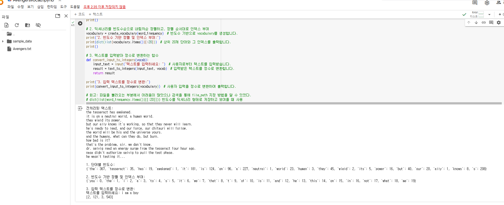
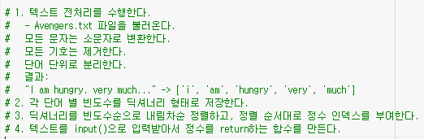
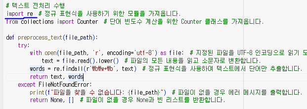
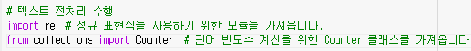

# AIFFEL Campus Online Code Peer Review Templete
- 코더 : 오병철
- 리뷰어 : 안승보


# PRT(Peer Review Template)
- [X]  **1. 주어진 문제를 해결하는 완성된 코드가 제출되었나요?**
    - 

- [X]  **2. 전체 코드에서 가장 핵심적이거나 가장 복잡하고 이해하기 어려운 부분에 작성된 
주석 또는 doc string을 보고 해당 코드가 잘 이해되었나요?**
    - 
    - 요구사항에 정의된 'file_name.txt' 파일을 읽기, dict 자료형 만들기, 사용자에게 input을 받는 부분 등 프로그램에 대한 로직을 간결하게 작성하신 것 같습니다.

- [X]  **3. 에러가 난 부분을 디버깅하여 문제를 해결한 기록을 남겼거나
새로운 시도 또는 추가 실험을 수행해봤나요?**
    - 
    - re.findall() 함수를 단어만 추출해서 사용하기 위해 찾았음. 하지만, import re를 하지 않아서 코드가 동작하지 않음.
    - 디버깅을 위해 에러가 난 부분부터 문제를 해결해보시면 좋을 것 같습니다.
        
- [X]  **4. 회고를 잘 작성했나요?**
    - file I/O, dict 자료형에 대한 출력과 할당 부분에서 어려움을 겪으셨지만 검색과 다른 도구들을 활용해서 문제를 잘 해결하신 것 같습니다.
        
- [X]  **5. 코드가 간결하고 효율적인가요?**
    - 
    - inline comment 사용에 대해 고민해보시면 좋을 것 같습니다.
    - 함수 및 변수명 작성을 할 때 목적에 맞게 작성하시는 게 좋을 것 같습니다.

# 회고(참고 링크 및 코드 개선)
- https://peps.python.org/pep-0008/#
- https://docs.python.org/3/library/re.html#re.findall
```
# 리뷰어의 회고를 작성합니다.
# 코드 리뷰 시 참고한 링크가 있다면 링크와 간략한 설명을 첨부합니다.
# 코드 리뷰를 통해 개선한 코드가 있다면 코드와 간략한 설명을 첨부합니다.
```
