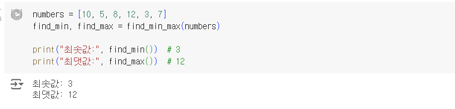
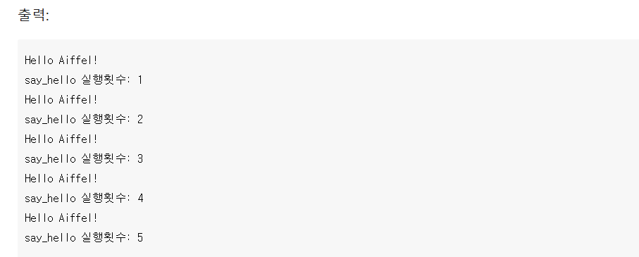

# AIFFEL Campus Online Code Peer Review Templete
- 코더 : 오병철
- 리뷰어 : 안승보

# PRT(Peer Review Template)
- [X]  **1. 주어진 문제를 해결하는 완성된 코드가 제출되었나요?**
    - 
    - 문제에서 요구하는 최솟값, 최댓값을 확인할 수 있었습니다.

    - 
    - 문제에서 요구하는 함수의 실행횟수를 확인할 수 있었습니다.
    
- [X]  **2. 전체 코드에서 가장 핵심적이거나 가장 복잡하고 이해하기 어려운 부분에 작성된 
주석 또는 doc string을 보고 해당 코드가 잘 이해되었나요?**
    - 주석을 보고 코드를 이해할 수 있게 잘 정리하신 것 같습니다.
        
- [X]  **3. 에러가 난 부분을 디버깅하여 문제를 해결한 기록을 남겼거나
새로운 시도 또는 추가 실험을 수행해봤나요?**
    - 코드를 작성하시면서 indent를 맞추지 않아서 에러가 발생한 부분이 있었습니다.
        
- [ ]  **4. 회고를 잘 작성했나요?**
        
- [X]  **5. 코드가 간결하고 효율적인가요?**
    - PEP8에 근거하여 comment를 잘 작성해주셨습니다.


# 회고(참고 링크 및 코드 개선)
```
- https://peps.python.org/pep-0008/
- https://pythontutor.com/visualize.html#mode=edit
```
